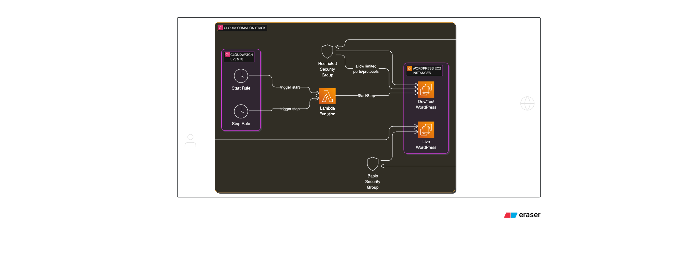

# WordPress Deployment with AWS CloudFormation and Lambda Scheduler

## Project Overview

This project showcases an automated and cost-optimized solution for deploying and managing WordPress instances on AWS. It leverages AWS CloudFormation for robust Infrastructure as a Code (IaaC) and a custom AWS Lambda function for intelligent, time-based instance management.

The solution addresses a common real-world scenario where organizations require distinct environments (production and development/testing) for their content management systems while optimizing operational costs.

## Key Features

* **Production WordPress Instance**: Automated deployment of a live, public-facing WordPress blog, configured to run 24/7.
* **Development/Testing WordPress Instance**: A separate, isolated WordPress environment dedicated for development, testing, and staging new content or features. This setup ensures that any experimental work does not impact the live blog.
* **Cost-Optimized Scheduling**: The development/testing instance is intelligently configured to be available *only during business hours* (Monday to Friday, 9 AM – 6 PM BST). This automated scheduling, powered by AWS Lambda and CloudWatch Events, significantly reduces EC2 operational costs by ensuring the instance is shut down when not in use.
* **AWS CloudFormation (IaaC)**: All underlying AWS infrastructure (EC2 instances, security groups, IAM roles, Lambda functions, CloudWatch Event Rules) is defined as code. This enables reproducible deployments, easy version control, and consistent environment setup/teardown across different AWS accounts or regions.
* **AWS Lambda for Scheduling**: A lightweight, serverless Python function acts as the brain for the scheduling logic, interacting directly with EC2 to start and stop the development instance based on predefined schedules.
* **Separation of Environments**: Clear isolation between the production and development environments, crucial for maintaining stability and preventing unintended changes to the live website.

## Real-World Scenario Addressed

As an organization focused on publishing blogs and providing documentation services, we faced the need for efficient management of our WordPress environments. This project provides a robust solution by:

1.  **Establishing a Live Blog**: Setting up a production-grade WordPress instance designed for public access and continuous operation.
2.  **Creating a Dedicated Dev/Test Environment**: Providing a sandboxed WordPress instance for internal teams to develop, test new functionalities, or preview content changes without affecting the live site.
3.  **Achieving Cost Efficiency**: Implementing an automated scheduling mechanism for the dev/test instance, ensuring it only runs when needed, thereby minimizing expenditure on AWS EC2 resources.

## Architecture Diagram




* AWS CloudFormation as the orchestrator.
* Two distinct EC2 instances: "Live WordPress" and "Dev/Test WordPress".
* "Live WordPress" connected directly to the internet (or via a basic security group).
* "Dev/Test WordPress" connected to the internet (via a security group, possibly restricted to your IP).
* CloudWatch Events (depicting two rules for Start/Stop times, e.g., a clock icon) pointing to an AWS Lambda function.
* The AWS Lambda function pointing to and interacting with the "Dev/Test WordPress" EC2 instance (showing Start/Stop actions).
* Show arrows for user access to the "Live WordPress" instance.)*

## Technologies Used

* **AWS Services**:
    * **CloudFormation**: For declaring and provisioning infrastructure.
    * **EC2**: Virtual servers hosting the WordPress application and database.
    * **Lambda**: Serverless compute for the scheduling logic.
    * **CloudWatch Events**: For triggering Lambda functions on a cron-based schedule.
    * **IAM**: For secure access management and defining permissions for roles used by EC2 and Lambda.
* **WordPress**: The Content Management System (CMS) being deployed.
* **Python (Boto3)**: The programming language and AWS SDK used in the Lambda function to interact with AWS services.
* **Bash Scripting**: Utilized within EC2 User Data to automate the installation and configuration of WordPress, Apache, and MariaDB.

## Deployment Steps

To deploy this project successfully in your AWS account, follow these steps:

## Prerequisites

Before you begin, ensure you have the following:

* **An AWS Account**: With sufficient permissions to create EC2 instances, Lambda functions, IAM roles, and CloudWatch Event Rules.
* **AWS CLI Configured**: The AWS Command Line Interface should be installed and configured with your AWS credentials.
* **An EC2 Key Pair**: You must have an existing EC2 Key Pair in the AWS region where you plan to deploy. If not, create one via the EC2 console.
* **Python 3.x and `zip` utility**: Required on your local machine to package the Lambda function code.

## 1. Clone the Repository

Start by cloning this repository to your local machine:

```bash
git clone [https://github.com/iamkjn/wordpress-aws-cf-lambda-scheduler.git](https://github.com/iamkjn/wordpress-aws-cf-lambda-scheduler.git)
cd wordpress-aws-cf-lambda-scheduler
```

## 2. Package the Lambda Function
The Lambda function's Python code needs to be packaged into a .zip file for CloudFormation to deploy it.
### Navigate into the lambda directory
```cd lambda/```

### Create the zip file containing the Python script
```zip ec2_scheduler.zip ec2_scheduler.py```

### Move the zip file to the cloudformation directory for easy referencing by the CFN template
```mv ec2_scheduler.zip ../cloudformation/```

### Navigate back to the root of the project
```cd ../```

## 3. Deploy the Live WordPress Instance
This CloudFormation template will provision your production-ready WordPress blog.

```aws cloudformation create-stack \
  --stack-name WordPressLiveBlog \
  --template-body file://cloudformation/wordpress-live.yaml \
  --parameters ParameterKey=KeyPairName,ParameterValue=YOUR_KEY_PAIR_NAME \
               ParameterKey=MyIpAddress,ParameterValue="YOUR_PUBLIC_IP/32" \
  --capabilities CAPABILITY_IAM \
  --region YOUR_AWS_REGION 
```

YOUR_KEY_PAIR_NAME: Replace with the actual name of your EC2 Key Pair (e.g., my-ssh-key).
YOUR_PUBLIC_IP/32: Replace with your current public IPv4 address followed by /32 (e.g., 192.0.2.10/32). 
This restricts SSH access to your IP for security. For public HTTP/HTTPS access, 0.0.0.0/0 is used by default in the template.
YOUR_AWS_REGION: Replace with your desired AWS region (e.g., eu-west-2 for London, us-east-1 for N. Virginia).

## 4. Deploy the Dev/Test WordPress Instance
This template sets up your development/testing WordPress environment.

```aws cloudformation create-stack \
  --stack-name WordPressDevTest \
  --template-body file://cloudformation/wordpress-dev-test.yaml \
  --parameters ParameterKey=KeyPairName,ParameterValue=YOUR_KEY_PAIR_NAME \
               ParameterKey=MyIpAddress,ParameterValue="YOUR_PUBLIC_IP/32" \
  --capabilities CAPABILITY_IAM \
  --region YOUR_AWS_REGION
```
Ensure YOUR_KEY_PAIR_NAME, YOUR_PUBLIC_IP/32, and YOUR_AWS_REGION match the values used for the Live instance.

## 5. Deploy Lambda Scheduler Resources
This template deploys the Lambda function and the CloudWatch Event Rules that will automatically start and stop your dev/test instance.

Important: Before running this command, ensure you have the ec2_scheduler.zip file in the cloudformation/ directory (as per Step 2).

```aws cloudformation create-stack \
  --stack-name LambdaScheduler \
  --template-body file://cloudformation/lambda-scheduler-resources.yaml \
  --parameters ParameterKey=DevTestInstanceId,ParameterValue=YOUR_DEV_TEST_INSTANCE_ID \
  --capabilities CAPABILITY_IAM \
  --region YOUR_AWS_REGION
```
YOUR_DEV_TEST_INSTANCE_ID: After the WordPressDevTest stack successfully creates, navigate to the AWS CloudFormation console, select the WordPressDevTest stack, and find the DevTestInstanceId in the "Outputs" tab. Copy this ID and use it here.
YOUR_AWS_REGION: Use the same region as your EC2 instances.

## 6. Accessing Your WordPress Instances
Once all three CloudFormation stacks (WordPressLiveBlog, WordPressDevTest, LambdaScheduler) show CREATE_COMPLETE status:

Go to the AWS CloudFormation console.
Select the WordPressLiveBlog stack, then click the "Outputs" tab. Copy the WordPressLiveURL.
Select the WordPressDevTest stack, then click the "Outputs" tab. Copy the WordPressDevTestURL.
Paste these URLs into your web browser. You will be greeted by the standard WordPress setup wizard. Complete the installation for both instances.

Observe the Dev/Test Instance: The WordPressDevTestURL will only be accessible during the scheduled office hours (Monday-Friday, 9 AM - 6 PM BST). Outside these hours, the instance will be stopped, and the URL will not resolve.

Clean Up
To avoid any ongoing AWS charges, it's crucial to delete the CloudFormation stacks when you are done. Delete them in the following order to respect dependencies:

Delete the LambdaScheduler stack (as it depends on the Dev/Test instance ID).
Delete the WordPressDevTest stack.
Delete the WordPressLiveBlog stack.
You can do this from the AWS CloudFormation console or using the AWS CLI:
``` 
aws cloudformation delete-stack --stack-name LambdaScheduler --region YOUR_AWS_REGION
aws cloudformation delete-stack --stack-name WordPressDevTest --region YOUR_AWS_REGION
aws cloudformation delete-stack --stack-name WordPressLiveBlog --region YOUR_AWS_REGION
```
(Remember to replace YOUR_AWS_REGION)
